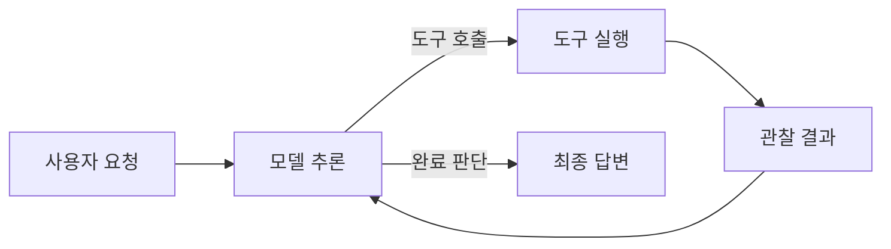
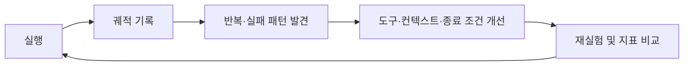
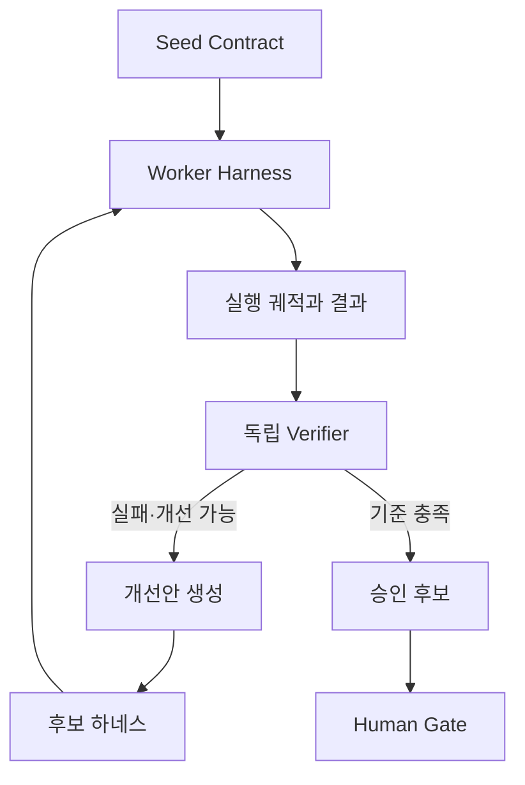
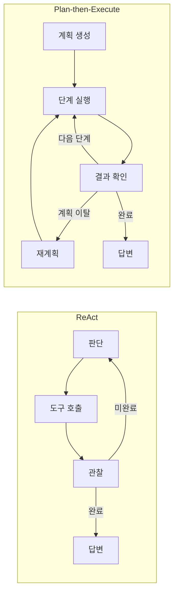
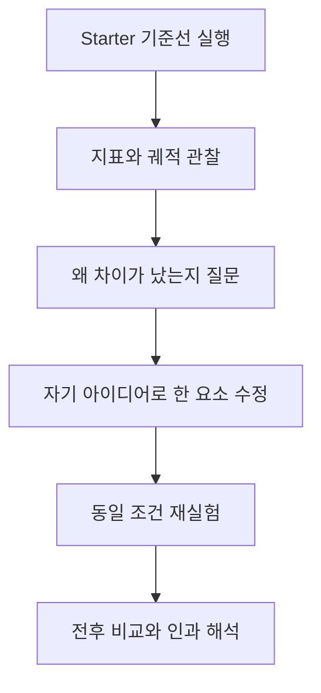
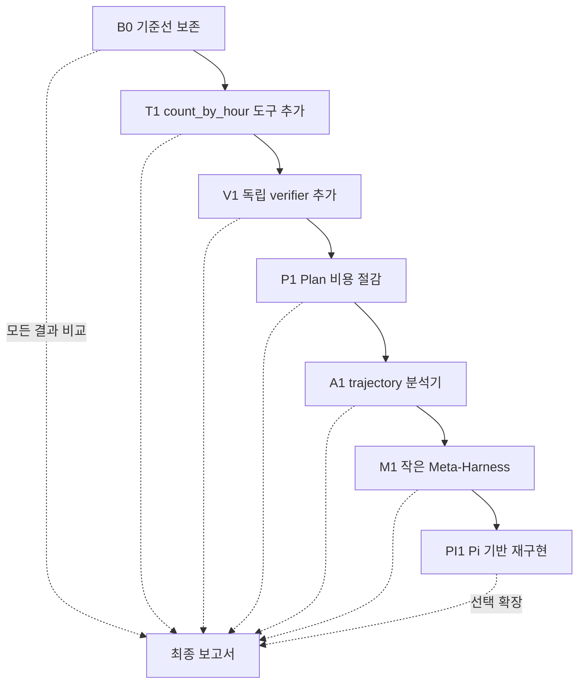
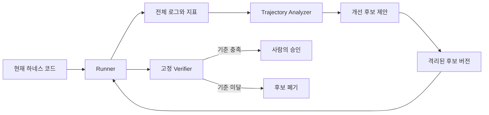

# Week 2 강의 정리

이 문서는 Week 2 수업 녹취록 `AX-2-1`, `AX-2-2`, `AX-2-3`을 바탕으로 작성했다.
각 교시의 **이론**은 강의에서 설명된 내용을 정리한 것이고, **교수님이 관심 있어 보이는 것**은 반복적으로 강조하거나 직접 해보기를 권한 주제를 중심으로 정리한 나의 해석이다.

---

## 2-1: Agent Harness와 ReAct

### 이론

#### 1. 에이전트와 하네스

에이전트는 단순히 LLM을 한 번 호출하는 프로그램이 아니다. 모델에 컨텍스트와 도구를 제공하고, 모델의 판단에 따라 도구를 실행한 뒤 그 결과를 다시 모델에게 돌려주는 반복 구조가 필요하다. 이 실행 환경 전체를 **에이전트 하네스(agent harness)**라고 볼 수 있다.

하네스의 기본 흐름은 다음과 같다.



#### 2. ReAct

ReAct는 **Thought → Action → Observation**을 반복하는 방식이다.

- Thought: 현재 상황에서 무엇을 해야 할지 판단한다.
- Action: 필요한 도구를 선택해 호출한다.
- Observation: 도구 실행 결과를 확인한다.
- 관찰 결과를 근거로 다음 행동을 결정하거나 답을 종료한다.

Chain-of-Thought만 길게 이어 가면 초반의 잘못된 추론이 뒤 단계까지 전파될 수 있다. ReAct는 외부 도구의 실제 결과를 Observation으로 받아 추론을 수정할 기회를 만든다.

#### 3. 하네스 설계의 다섯 요소

1. **컨텍스트 관리**: 대화와 실행 기록이 길어질 때 무엇을 유지하고 압축할지 결정한다.
2. **도구의 세분성**: 작은 범용 도구를 줄지, 여러 동작을 결합한 고수준 도구를 줄지 결정한다.
3. **종료 조건**: 모델의 완료 선언, `finish` 도구, `max_steps`, 테스트 통과 등 명시적인 종료 기준을 둔다.
4. **오류 복구**: 도구 오류를 숨기지 않고 Observation으로 반환해 모델이 수정할 수 있게 한다.
5. **Human Gate**: 비용이 크거나 되돌리기 어렵고 책임이 필요한 행동은 사람의 승인을 거치게 한다.

#### 4. 도구의 세분성

처음에는 `read_file`, `count_pattern`처럼 작고 범용적인 도구로 시작할 수 있다. 실행 궤적에서 동일한 도구 조합이 반복된다면, 그 패턴을 `count_by_hour` 같은 복합 도구로 승격할 수 있다. 이는 추상적인 추측보다 실제 사용 기록에서 필요한 도구를 귀납적으로 발견하는 방식이다.

#### 5. 종료와 검증

모델이 “완료했다”고 말하는 것만으로 실제 완료를 보장할 수 없다. 테스트, 파일 존재 여부, 예상 출력 비교처럼 가능한 부분은 결정론적으로 검사해야 한다. `max_steps`는 무한 반복을 막는 안전장치이지만, 정답의 신뢰성을 보증하는 검증기는 아니다.

#### 6. 관측 가능성

에이전트를 개선하려면 최종 답만 보는 것이 아니라 프롬프트, 도구 호출, Observation, 오류, 토큰 사용량, 반복 횟수로 이루어진 **trajectory(실행 궤적)**를 기록해야 한다. 측정 가능한 시스템이어야 병목과 실패 원인을 찾아 개선할 수 있다.

### 교수님이 관심 있어 보이는 것

#### 강의에서 직접 강조하거나 권한 것

- ReAct 논문과 *The Bitter Lesson*을 읽고 에이전트 설계와 연결해 보기
- Codex, Oh My Pi 같은 코딩 에이전트의 컨텍스트 압축 방식을 살펴보기
- 실제 코딩 에이전트의 실행 궤적을 분석하기
- Microsoft SkillOpt, Auto-Dreaming 등 실행 기록에서 스킬을 발굴하는 접근 살펴보기
- Meta-Harness처럼 에이전트 하네스 자체를 개선하는 연구 살펴보기
- 도구의 세분성을 바꾸었을 때 성공률·토큰·호출 수가 어떻게 변하는지 실험하기

#### 나의 해석

교수님은 단순히 더 강한 모델을 붙이는 것보다 **에이전트의 실행 과정을 관찰하고, 반복 패턴을 찾아 하네스 구조를 개선하는 연구**에 큰 관심이 있어 보인다. 특히 다음 흐름이 강의 전반에서 반복된다.



따라서 단순 구현보다 “어떤 실행 기록을 근거로 무엇을 바꾸었고, 그 결과 지표가 어떻게 달라졌는가”를 설명할 수 있는 작업을 흥미롭게 볼 가능성이 크다.

---

## 2-2: Meta-Harness와 자기 개선

### 이론

#### 1. Meta-Harness

일반 하네스가 작업을 수행하는 에이전트를 감싸는 구조라면, **Meta-Harness**는 그 하네스를 평가하고 개선하는 바깥쪽 반복 구조다. 개선 에이전트에는 단순 요약만 주기보다 현재 코드, 점수, 실패 사례, 실행 궤적처럼 원인 분석에 필요한 증거를 제공해야 한다.



#### 2. 독립 검증기

작업을 수행한 에이전트와 검증기가 같은 컨텍스트를 공유하면 작업자의 가정과 오류까지 함께 물려받을 수 있다. 가능하면 별도의 세션이나 독립된 컨텍스트에서 검증하고, 자연어 자기평가보다 테스트나 스키마 검사 같은 외부 증거를 사용해야 한다.

#### 3. Ouroboros 구조

강의에서 설명한 자기 개선 구조는 다음 요소로 이해할 수 있다.

- **Seed Contract**: 시스템의 목표, 허용 범위, 평가 기준을 정의한다.
- **Runner/Trace**: 현재 하네스를 실행하고 전체 궤적을 남긴다.
- **Deterministic Verifier**: 결과가 기준을 충족했는지 외부에서 검사한다.
- **Evolution Loop**: 실패와 비용을 분석해 새로운 후보를 만들고 다시 평가한다.

자기 개선 시스템이 평가 기준까지 임의로 바꾸게 하면 보상 해킹이 일어날 수 있다. 따라서 핵심 acceptance criteria와 verifier는 쉽게 변하지 않는 기준으로 두어야 한다.

#### 4. 자기 개선 연구의 흐름

강의에서는 Self-Refine, Reflexion, DSPy, GEPA, Meta-Harness, Darwin Gödel Machine 등 모델이나 에이전트가 피드백을 이용해 자신을 개선하는 연구 흐름을 함께 다뤘다. 공통점은 실행 결과를 평가하고 그 피드백을 다음 시도에 반영하는 것이다.

#### 5. 자동화의 경계

에이전트가 개선안을 제안하고 실험하는 부분은 자동화할 수 있지만, 운영 배포나 책임이 따르는 의사결정까지 자동 승인하는 것은 위험하다. 먼저 제한된 범위의 canary 실험으로 확인하고 최종 승인은 Human Gate에 남기는 방식이 필요하다.

### 교수님이 관심 있어 보이는 것

#### 강의에서 직접 강조하거나 권한 것

- 결과 요약보다 전체 코드, 점수, 실패 궤적을 개선 루프의 입력으로 사용하기
- 작업자와 분리된 독립 verifier를 설계하기
- acceptance criteria를 고정해 자기 개선 과정의 보상 해킹을 막기
- 자기 개선 에이전트가 어디까지 제안하고 사람이 어디서 승인할지 경계를 설계하기
- Meta-Harness와 Darwin Gödel Machine 같은 자기 개선 시스템 연구하기
- 수업 밖에서도 연구 살롱에 참여하고, 필요한 경우 GPU 지원을 받아 실험하기

#### 나의 해석

교수님은 “에이전트가 스스로 코드를 고친다”는 시연 자체보다, **검증 가능한 자기 개선 시스템을 어떻게 안전하게 설계할 것인가**에 관심이 있어 보인다. 특히 작업자와 평가자의 분리, 변경 불가능한 평가 기준, 전체 궤적을 근거로 한 개선, 사람의 최종 책임이라는 네 요소가 중요하다.

연구 아이디어로 발전시킨다면 Worker–Verifier를 서로 다른 컨텍스트로 분리하고, 동일한 테스트셋에서 성공률·토큰·도구 호출 수를 측정하면서 하네스 개선안을 반복 적용하는 형태가 강의 방향과 잘 맞는다.

---

## 2-3: ReAct와 Plan-then-Execute 비교 실습

### 이론

#### 1. 통제된 A/B 비교

이번 실습은 같은 모델, 같은 태스크, 같은 도구를 사용하고 **하네스만** ReAct와 Plan-then-Execute로 바꾸어 차이를 비교한다. 다른 조건을 고정해야 결과 차이를 하네스 구조의 영향으로 해석할 수 있다.

#### 2. ReAct와 Plan-then-Execute

ReAct는 매 단계에서 관찰 결과를 보고 다음 행동을 결정한다. 필요한 행동만 수행하고 빠르게 끝날 수 있지만, 모델이 너무 일찍 완료를 선언하면 충분한 검증 없이 종료될 수 있다.

Plan-then-Execute는 먼저 전체 계획을 만든 뒤 각 단계를 실행한다. 구조적이고 계획을 점검하기 쉽지만, 이미 정답을 얻은 뒤에도 남은 계획을 계속 수행하거나 같은 정보를 반복해서 확인하면 토큰과 도구 호출이 크게 증가한다. 계획이 어긋났을 때 재계획을 허용하면 유연성은 높아지지만 비용도 늘 수 있다.



#### 3. 측정해야 하는 지표

- 태스크 성공 여부
- 사용 토큰 수
- 모델 호출 또는 반복 횟수
- 사람의 개입 횟수
- 재계획 횟수와 도구 오류
- 실행 시간과 실패 궤적

한 번의 실행은 모델 출력의 확률성 때문에 우연일 수 있으므로 같은 조건에서 최소 세 번 실행하고 평균뿐 아니라 분산과 개별 궤적도 함께 살펴야 한다.

#### 4. 검소함(Frugality)

에이전트 평가는 정답 여부만으로 끝나지 않는다. 같은 성공을 더 적은 토큰과 도구 호출로 달성한다면 더 검소한 하네스다. 다만 호출 수를 줄이느라 검증을 제거하면 신뢰성이 낮아질 수 있으므로 성공률, 비용, 검증 강도를 함께 봐야 한다.

#### 5. 도구 개선 사례

로그를 시간대별로 집계하는 태스크에서 `count_pattern`을 시간마다 반복 호출하는 대신 `count_by_hour`처럼 태스크에 맞는 복합 도구를 만들 수 있다. 교수님은 실습 중 실제로 이 방향으로 도구를 바꾸었고 토큰과 실행 시간이 줄어드는 결과를 확인했다. 이는 2-1에서 설명한 “반복 궤적에서 새로운 도구를 귀납적으로 발견한다”는 원리가 실습에 적용된 사례다.

#### 6. Pi 기반 확장

기본 실습 코드는 Python으로 모델 호출, 메시지 상태, 도구 스키마, 실행 반복을 직접 구현한다. 욕심이 있는 학생은 같은 ReAct/Plan 정책을 유지하면서 이 실행 백본을 Pi의 에이전트 런타임에 올리는 확장을 시도할 수 있다. 이는 Pi에게 코드를 대신 작성시키라는 뜻이 아니라, 직접 만든 하네스의 실행 기반을 Pi로 교체하고 구조와 지표의 차이를 비교해 보라는 선택 과제에 가깝다.

#### 7. 실습과 과제의 차이

- 실습: 두 하네스를 구현하고 같은 태스크로 반복 실행해 결과와 로그를 얻는다.
- 과제: 왜 차이가 발생했는지 실행 궤적을 근거로 해석하고, 구조도와 개선 아이디어를 보고서로 제출한다.

코딩 에이전트를 사용해 구현할 수는 있지만, 생성된 코드를 읽고 실행 구조를 직접 설명할 수 있어야 한다. Mermaid 구조도 역시 장식이 아니라 자신이 만든 하네스의 흐름을 이해했는지 확인하는 도구다.

### 교수님이 관심 있어 보이는 것

#### 강의에서 직접 강조하거나 권한 것

- 제공된 starter를 그대로 실행하는 데서 끝내지 말고 자신의 취향과 아이디어를 반영해 수정하기
- 자신의 하네스 구조를 Mermaid로 그려 보기
- 반복되는 `count_pattern`을 `count_by_hour` 같은 복합 도구로 바꾸고 전후 지표를 비교하기
- Plan-then-Execute를 어떻게 더 검소하게 만들지 고민하기
- ReAct가 verifier 없이 빨리 낸 답을 신뢰할 수 있는지 질문하기
- 모델과 하네스에 따라 Plan 방식의 비용 차이가 왜 크게 달라지는지 궤적으로 설명하기
- 더 확장하고 싶은 경우 실습 백본을 Pi 기반으로 바꾸어 보기
- 구현 결과보다 자신의 사고 과정, 실패한 시도, 해석을 보고서에 솔직하게 남기기

#### 나의 해석

교수님이 보고 싶어 하는 것은 starter의 단순 실행 결과가 아니라 다음과 같은 작은 연구 사이클로 보인다.



따라서 가장 수업 취지에 맞는 확장은 기능을 많이 추가하는 것이 아니라, 예를 들어 도구 하나를 `count_by_hour`로 개선한 뒤 기준선과 다시 비교하여 **왜 토큰·호출 수·오류 양상이 변했는지 증거로 설명하는 것**이다. Pi 기반 재구현은 더 큰 확장안이고, 먼저 작은 변경을 정확히 측정하는 편이 연구 결과로서 해석하기 쉽다.

---

## 세 교시를 관통하는 핵심

Week 2의 전체 흐름은 다음 한 문장으로 요약할 수 있다.

> 에이전트의 성능은 모델만이 아니라 하네스에 의해 결정되며, 실행 궤적을 측정하고 독립적으로 검증하면서 도구·컨텍스트·종료 조건을 반복 개선해야 한다.

교수님의 관심은 특히 다음 연결에 집중되어 있다고 해석했다.

1. **관측 가능성**: 전체 trajectory를 남긴다.
2. **패턴 발견**: 반복 호출, 오류, 불필요한 계획 단계를 찾는다.
3. **하네스 개선**: 도구 세분성, 컨텍스트, 종료·검증 방식을 바꾼다.
4. **통제 실험**: 나머지 조건을 고정하고 여러 번 재실행한다.
5. **독립 검증**: 작업자의 자기평가와 분리된 기준으로 결과를 확인한다.
6. **안전한 자기 개선**: 개선안은 자동 생성할 수 있지만 평가 기준과 최종 승인은 보호한다.

이 관점에서 좋은 제출물이나 후속 연구는 “무엇을 만들었다”에 그치지 않고, **실행 기록에서 어떤 문제를 발견했고 어떤 변경이 어떤 지표를 왜 바꾸었는지**까지 보여 주는 작업이다.

---

# 논문 읽기

논문은 많이 읽는 것보다, 현재 실습의 코드와 실행 로그에 질문을 던지면서 읽는 것을 목표로 한다. 논문마다 아래 네 가지를 한 페이지 이내로 기록한다.

1. 논문이 해결하려는 문제는 무엇인가?
2. 핵심 아이디어를 내 말로 한 문장으로 표현하면 무엇인가?
3. 이 아이디어는 현재 Week 2 하네스의 어느 부분에 대응하는가?
4. 실제 코드에 적용한다면 무엇을 바꾸고 어떤 지표로 효과를 검증할 것인가?

## 1순위: 현재 실습을 이해하기 위한 읽기

### ReAct: Synergizing Reasoning and Acting in Language Models

- 가장 먼저 전문을 읽는다.
- Thought, Action, Observation이 각각 어떤 역할을 하는지 표시한다.
- 단순 Chain-of-Thought와 비교해 외부 Observation이 오류 수정에 어떻게 기여하는지 본다.
- 논문의 ReAct와 현재 `harness_react.py`의 공통점과 차이점을 표로 정리한다.
- 현재 하네스가 너무 일찍 답을 종료할 가능성과 이를 막을 verifier의 필요성을 생각한다.

읽은 뒤 답할 질문:

- 지금 구현은 정말 ReAct인가, 아니면 도구 호출이 가능한 단순 반복문인가?
- 모델이 정답을 얻었다는 사실과 정답을 검증했다는 사실은 어떻게 다른가?
- Thought를 로그로 남기는 것의 장점과 위험은 무엇인가?

### The Bitter Lesson

논문은 아니지만 교수님이 ReAct와 함께 읽기를 권한 글이므로 먼저 읽는다.

- 사람이 세밀하게 설계한 규칙과 계산·탐색을 활용하는 범용 방법의 차이를 정리한다.
- `count_by_hour` 같은 태스크 특화 도구가 단기 효율에는 좋지만 범용성을 낮출 수 있는지 생각한다.
- 하네스에 지식을 직접 넣는 것과 모델이 도구를 이용해 스스로 탐색하게 하는 것의 균형을 정리한다.

읽은 뒤 답할 질문:

- 복합 도구 추가는 Bitter Lesson과 충돌하는가, 아니면 계산 자원을 효율적으로 제공하는가?
- 사람의 규칙을 어디까지 코드에 넣고 어디부터 모델에게 맡겨야 하는가?

## 2순위: 피드백과 자기 수정을 이해하기 위한 읽기

### Self-Refine: Iterative Refinement with Self-Feedback

- 하나의 모델이 생성, 피드백, 수정을 반복하는 구조를 파악한다.
- 같은 컨텍스트 안에서 자기 피드백을 수행할 때 처음의 오류를 공유할 가능성을 살펴본다.
- Week 2의 재계획과 Self-Refine의 수정 반복을 비교한다.

### Reflexion: Language Agents with Verbal Reinforcement Learning

- 실패 경험을 언어 형태의 메모리로 남겨 다음 실행에 사용하는 방식을 파악한다.
- 단일 실행 중 Observation을 이용하는 ReAct와 여러 실행 사이의 경험을 축적하는 Reflexion을 구분한다.
- 현재 로그에서 다음 실행에 전달할 가치가 있는 정보와 버려야 할 정보를 분류한다.

읽은 뒤 비교할 질문:

- Self-Refine의 같은 세션 자기비판과 독립 verifier 중 어느 쪽이 더 믿을 만한가?
- Reflexion 메모리가 쌓일수록 컨텍스트 비용과 잘못된 교훈의 위험을 어떻게 관리할 것인가?

## 3순위: 프롬프트·하네스 최적화를 이해하기 위한 읽기

### DSPy

- 프롬프트 문자열을 손으로 조정하는 대신 프로그램의 구성요소와 평가 지표를 정의하고 최적화하는 관점을 익힌다.
- 데이터셋, metric, optimizer가 각각 현재 실습의 task, judge, 개선 루프와 어떻게 대응하는지 정리한다.
- 성공 여부만 metric으로 둘 때와 토큰 비용까지 함께 포함할 때 최적화 결과가 어떻게 달라질지 생각한다.

### GEPA

- 실행 궤적과 자연어 피드백을 이용해 시스템 구성요소를 개선하는 방식을 살펴본다.
- 최종 점수만 사용하는 개선과 전체 trajectory를 사용하는 개선의 정보량 차이를 정리한다.
- 현재 `logs/`에서 GEPA식 개선에 필요한 정보가 충분한지 점검한다.

### SkillOpt·Auto-Dreaming 계열

- 반복되는 작업 패턴에서 재사용 가능한 skill이나 도구를 발굴하는 방법을 살펴본다.
- `count_pattern`의 반복이 `count_by_hour`라는 복합 도구 후보로 바뀌는 과정을 작은 사례로 연결한다.
- 자동으로 제안된 skill을 바로 채택하지 않고 별도 평가셋에서 검증하는 방법을 생각한다.

## 4순위: 검증 가능한 자기 개선을 위한 읽기

### Meta-Harness

- 작업 에이전트의 바깥에서 하네스 자체를 평가하고 수정하는 구조를 파악한다.
- 개선 에이전트에 요약만 줄 때와 코드·점수·전체 궤적을 함께 줄 때의 차이를 본다.
- Seed Contract, Runner, Verifier, Evolution Loop를 현재 프로젝트 파일에 대응시켜 구조도를 다시 그린다.

### Darwin Gödel Machine

- 에이전트가 자신의 코드를 수정하고 경험적으로 더 나은 후보를 선택하는 구조를 살펴본다.
- 자기 수정 범위와 변경할 수 없는 평가 기준의 경계를 확인한다.
- 성능 향상이 특정 테스트에 대한 과적합이나 보상 해킹은 아닌지 검증하는 방식을 정리한다.

읽은 뒤 답할 질문:

- 개선 에이전트가 verifier까지 수정할 수 있으면 어떤 문제가 생기는가?
- 후보 하네스를 운영 환경에 적용하기 전에 canary와 Human Gate가 왜 필요한가?
- “스스로 개선했다”는 주장을 인정하려면 최소한 어떤 실험 증거가 필요한가?

## 논문 노트 작성 형식

각 읽기 결과는 이후 `paper-notes/` 폴더에 다음 형식으로 남길 계획이다.

```markdown
# 논문 제목

## 문제
## 핵심 아이디어
## 주요 구조도
## 실험과 평가 지표
## 인상적인 점
## 동의하기 어려운 점 또는 한계
## Week 2 코드와 연결되는 부분
## 직접 실험해 볼 가설
```

---

# 실습 할 계획

## 최종 목표

단순히 새로운 기능을 많이 붙이는 것이 아니라, **실행 궤적에서 문제를 발견하고 하네스의 한 요소만 수정한 뒤 같은 조건으로 다시 측정하여 인과관계를 설명하는 것**을 목표로 한다.

현재 기준선에서는 두 하네스 모두 정답을 맞혔지만 평균 비용 차이가 컸다.

| 하네스 | 성공률 | 평균 토큰 | 평균 모델 호출 수 | 관찰된 문제 |
|---|---:|---:|---:|---|
| ReAct | 3/3 | 3,943 | 2.0 | 빠르지만 별도 검증 없이 정답을 종료함 |
| Plan-then-Execute | 3/3 | 47,037 | 14.3 | 정답을 얻고도 계획을 계속 실행하고 도구 호출을 반복함 |

이 기준선을 보존한 상태에서 아래 실험을 순서대로 진행한다. 한 번에 여러 요소를 바꾸지 않고, 각 단계에서 하나의 독립변수만 변경한다.

## 전체 실습 로드맵



## 0단계: 기준선 보존과 실험 규칙 고정

### 목적

앞으로 코드가 바뀌어도 기존 결과와 공정하게 비교할 수 있도록 현재 상태를 기준선 B0로 고정한다.

### 할 일

1. 현재 `results.csv`, `logs/`, `REPORT.md`를 기준선 산출물로 유지한다.
2. 기준선 커밋 해시를 실험 노트에 기록한다.
3. 모델, temperature, 태스크, 입력 파일, 도구 목록, `max_steps`, 재계획 횟수를 기록한다.
4. API 키는 기록하지 않고 환경변수 이름만 남긴다.
5. 무료 OpenRouter 모델의 지연과 출력 변동 가능성을 실험의 제한점으로 명시한다.
6. 각 변형은 최소 3회 실행하고, 가능하면 5회 실행해 평균·최솟값·최댓값을 함께 본다.

### 고정 조건

- 모델: `nvidia/nemotron-3.5-lightning:free`
- 태스크: `app.log`에서 ERROR가 가장 많은 시간대를 `HH:00`으로 반환
- 입력 데이터: 동일한 `app.log`
- 성공 판정: 최종 답이 `14:00`인지 결정론적으로 비교
- 공통 지표: 성공, 토큰, 모델 호출 수, 도구 호출 수, 개입 수, 재계획 수, 실행 시간

### 산출물

- 기준선 설정을 적은 `experiments/README.md`
- 실행별 JSONL 또는 Markdown 로그
- 변형별 결과를 한 행씩 기록한 CSV

## 1단계: 반복 호출을 복합 도구로 바꾸기

### 관찰한 문제

Plan-then-Execute는 시간대별 ERROR 개수를 구하기 위해 `count_pattern`을 여러 번 호출했다. 이 과정에서 도구 호출 예산을 넘겨 `OFF_PLAN`이 발생했고 재계획까지 이어졌다.

### 가설 H1

`count_by_hour`라는 결정론적 복합 도구를 두 하네스에 동일하게 제공하면 성공률을 유지하면서 토큰, 모델 호출, 도구 호출, 실행 시간이 감소할 것이다. 특히 반복 호출이 많았던 Plan-then-Execute에서 감소 폭이 더 클 것이다.

### 구현 계획

1. `tools_shared.py`에 `count_by_hour(path, level)` 함수를 추가한다.
2. 파일을 한 번만 읽어 각 로그 행에서 시간과 로그 레벨을 파싱한다.
3. 결과는 모델이 해석하기 쉬운 구조화 데이터로 반환한다.

예상 반환 형태:

```json
{
  "level": "ERROR",
  "counts": {"09": 1, "10": 2, "14": 6},
  "max_hour": "14",
  "max_count": 6
}
```

4. 존재하지 않는 파일, 잘못된 로그 행, 해당 레벨이 없는 경우를 구분해 명확한 오류를 반환한다.
5. ReAct와 Plan-then-Execute가 완전히 같은 함수와 도구 스키마를 공유하게 한다.
6. 기존 `read_file`, `count_pattern`은 제거하지 않고 유지한다. 모델이 어떤 도구를 선택하는지도 관찰한다.
7. 두 하네스를 각각 5회 실행한다.

### 확인할 것

- 모델이 새 도구를 바로 선택하는가?
- 도구 설명을 바꾸면 선택률이 달라지는가?
- Plan이 `count_by_hour` 결과를 받고도 기존 계획의 나머지 단계를 계속 수행하는가?
- ReAct의 비용도 줄어드는가, 아니면 이미 한 번의 `read_file`로 해결해 변화가 거의 없는가?
- 복합 도구가 이 태스크에는 효율적이지만 다른 로그 질문에는 지나치게 특화된 것은 아닌가?

### 성공 기준

- 두 하네스 모두 5회 중 5회 정답
- Plan-then-Execute의 평균 도구 호출 수가 기준선보다 감소
- malformed path와 `OFF_PLAN` 발생 횟수가 기준선보다 감소
- 단순히 빨라졌다는 결론이 아니라 어떤 호출이 사라졌는지 로그로 제시

## 2단계: ReAct에 독립 verifier 추가하기

### 관찰한 문제

ReAct는 적은 비용으로 정답을 냈지만, 모델이 답을 말한 뒤 외부 검증 없이 종료했다. 빠르다는 사실과 믿을 수 있다는 사실은 다르다.

### 가설 H2

모델과 분리된 결정론적 verifier를 추가하면 토큰과 호출 수는 조금 늘지만, 잘못된 답을 통과시키지 않는 신뢰성을 얻을 수 있다.

### 구현 계획

1. worker가 낸 최종 답에서 `HH:00` 형식을 파싱한다.
2. verifier는 모델을 호출하지 않고 Python으로 `app.log`를 직접 집계한다.
3. worker의 답과 verifier의 계산 결과를 비교한다.
4. 일치하면 종료하고, 불일치하면 오류 Observation을 worker에게 한 번만 돌려준다.
5. 재시도 후에도 불일치하면 실패로 기록한다.
6. verifier는 worker의 Thought나 주장에 의존하지 않고 원본 파일만 읽는다.

### 테스트 케이스

- 정상 답 `14:00`은 통과
- 오답 `13:00`은 거부
- 형식 오류 `14`, `2 PM`, 빈 문자열은 거부
- 동률인 데이터가 들어왔을 때의 정책을 명시
- 빈 로그와 잘못된 로그 행 처리 확인

### 비교 실험

- R0: 기존 ReAct
- R1: ReAct + verifier
- 두 변형을 정상 태스크와 의도적으로 교란한 태스크에 각각 실행
- 성공률뿐 아니라 false acceptance, 재시도 횟수, 추가 토큰 비용 측정

### 성공 기준

- 올바른 답을 모두 통과
- 의도적으로 넣은 오답을 모두 차단
- verifier가 추가한 비용을 수치로 설명
- “ReAct가 더 효율적” 대신 “검증 수준이 같을 때에도 더 효율적인가?”를 다시 평가

## 3단계: Plan-then-Execute를 더 검소하게 만들기

### 관찰한 문제

Plan은 첫 단계에서 이미 `14:00`을 알아낸 실행에서도 남은 계획을 계속 수행했다. 계획 준수가 목표 달성보다 우선되어 비용이 커진 셈이다.

### 가설 H3

각 단계 뒤에 증거 기반 조기 종료 조건을 두면 성공률과 검증 강도를 유지하면서 불필요한 계획 실행을 줄일 수 있다.

### 변경 후보

한꺼번에 적용하지 않고 아래 순서대로 하나씩 실험한다.

#### P1: 조기 종료

- 각 단계가 끝날 때 최종 답 후보와 근거가 확보됐는지 검사한다.
- 결정론적 verifier가 후보를 승인하면 남은 계획을 취소하고 종료한다.
- 단순히 모델이 “완료”라고 말한 것만으로는 조기 종료하지 않는다.

#### P2: 계획 길이 제한

- 최초 계획을 최대 3단계로 제한한다.
- “파일 읽기 → 집계 → 검증 및 출력”처럼 결과 중심 단계로 계획하게 한다.
- 지나치게 미세한 계획과 지나치게 큰 계획의 비용 차이를 비교한다.

#### P3: 단계별 도구 호출 예산

- 단계 하나당 허용하는 도구 호출 횟수를 정한다.
- 예산을 넘기면 즉시 전체 재계획하지 않고 현재까지의 증거를 요약해 다음 결정을 내리게 한다.
- 예산 초과 자체를 로그에 별도 이벤트로 남긴다.

#### P4: 선택적 재계획

- 도구 오류가 발생했다고 무조건 재계획하지 않는다.
- 잘못된 경로처럼 국소적으로 수정 가능한 오류는 같은 단계에서 한 번 재시도한다.
- 계획 전체의 전제가 틀렸을 때만 재계획한다.

### 실험 방법

| 변형 | 조기 종료 | 계획 최대 길이 | 단계별 예산 | 선택적 재계획 |
|---|---:|---:|---:|---:|
| P0 기준선 | 없음 | 제한 없음 | 기존 설정 | 없음 |
| P1 | 있음 | 기준선과 동일 | 기준선과 동일 | 없음 |
| P2 | 있음 | 3단계 | 기준선과 동일 | 없음 |
| P3 | 있음 | 3단계 | 설정함 | 없음 |
| P4 | 있음 | 3단계 | 설정함 | 있음 |

각 행을 최소 5회 실행한다. 이전 행보다 평균 토큰이 줄었더라도 성공률이나 verifier 통과율이 낮아지면 개선으로 판정하지 않는다.

### 성공 기준

- verifier 기준 성공률 유지
- 평균 토큰과 모델 호출 수가 단계별로 감소
- 정답 확보 후 실행된 불필요한 단계 수 감소
- 재계획이 필요한 오류와 국소 재시도로 해결되는 오류를 로그에서 구분

## 4단계: trajectory 분석기 만들기

### 목적

로그를 사람이 매번 처음부터 읽지 않아도 반복 행동과 실패 패턴을 자동으로 요약하는 작은 분석기를 만든다. 교수님이 관심을 보인 trajectory 기반 skill 발견을 가장 작은 규모로 구현하는 단계다.

### 먼저 로그 스키마 통일하기

각 이벤트를 JSONL 한 줄로 기록한다.

```json
{
  "run_id": "P2-03",
  "harness": "plan_exec",
  "event": "tool_call",
  "step": 4,
  "tool": "count_pattern",
  "arguments": {"path": "app.log", "pattern": "ERROR"},
  "success": true,
  "latency_ms": 320,
  "tokens_total": 12345
}
```

### 분석기가 찾을 패턴

1. 같은 도구의 연속 호출
2. 인자 하나만 바뀌는 반복 호출
3. 동일한 파일을 반복해서 읽는 행동
4. 이미 정답 후보가 나온 뒤 발생한 호출
5. 오류 직전과 직후의 도구 호출
6. 재계획을 유발한 오류 유형
7. 호출 결과가 최종 답에 실제로 사용되지 않은 경우

### 출력 예시

```text
후보 패턴: count_pattern이 시간 인자만 바뀌며 평균 8.3회 반복됨
제안 도구: count_by_hour(path, level)
예상 효과: 도구 호출 8회 → 1회
검증 방법: 동일 태스크 5회 A/B 실행
```

### 구현 단계

1. 정규식과 Python 집계만 사용하는 결정론적 분석기를 먼저 만든다.
2. 분석 결과가 사람이 로그에서 발견한 패턴과 일치하는지 확인한다.
3. 이후 선택적으로 LLM에게 패턴 설명과 새 도구 스키마 초안을 제안하게 한다.
4. LLM 제안은 자동 적용하지 않고 후보 파일로만 저장한다.
5. 사람이 후보를 검토한 뒤 별도 실험 변형으로 채택한다.

### 성공 기준

- 현재 로그에서 `count_pattern` 반복과 정답 후 추가 실행을 탐지
- 잘못된 경로와 `OFF_PLAN`을 오류 패턴으로 분류
- 분석 결과만 읽어도 변경 가설과 검증 방법을 재현할 수 있음

## 5단계: 작은 Meta-Harness 만들기

### 목적

4단계 분석 결과를 이용해 개선 후보를 제안하고, 고정된 verifier와 실험 규칙으로 후보를 평가하는 바깥쪽 루프를 만든다.

### 구성



### 변경 불가능하게 둘 것

- 정답 데이터와 verifier
- 성공 판정 방식
- 최대 비용과 최대 반복 수
- 비교에 사용하는 입력 파일
- 원본 기준선 로그

### 자동화할 수 있는 것

- 실패·반복 패턴 요약
- 도구 설명 수정안 제안
- 계획 프롬프트 수정안 제안
- 후보별 자동 실행과 지표 수집
- 기준선보다 나은 후보 정렬

### 사람이 승인할 것

- 새 도구를 실제 공용 도구 목록에 추가하는 결정
- 평가 기준 변경
- 비용 한도 확대
- 원격 브랜치 반영과 PR 제출
- 외부 시스템에 영향을 주는 실행

### 후보 승인 규칙 예시

후보는 다음 조건을 모두 만족할 때만 승인 대상으로 표시한다.

1. 전체 테스트 성공률이 기준선 이상이다.
2. 평균 토큰 또는 모델 호출 수가 20% 이상 감소한다.
3. 새로운 처리되지 않은 오류가 발생하지 않는다.
4. verifier와 테스트 데이터는 변경되지 않았다.
5. 전체 diff와 실행 로그가 남아 있다.

## 6단계: Pi 기반 백본으로 재구현하기

이 단계는 앞의 작은 실험을 끝낸 후 진행하는 선택 확장이다. Python 버전을 삭제하거나 덮어쓰지 않고 `pi-version/`처럼 별도 폴더에 만든다.

### 목적

현재 Python 코드가 직접 담당하는 모델 호출, 메시지 상태, 도구 실행 반복, 이벤트 기록, 컨텍스트 처리를 Pi 런타임에 맡긴다. ReAct와 Plan-then-Execute라는 정책은 유지하여 런타임 교체의 효과를 비교한다.

### 진행 순서

1. 현재 Python 하네스의 구성요소를 표로 분해한다.
2. 각 요소가 Pi의 어떤 기능에 대응하는지 매핑한다.
3. 먼저 `read_file` 하나만 사용하는 최소 ReAct를 구현한다.
4. `count_pattern`, `count_by_hour`를 차례로 연결한다.
5. 도구 호출 이벤트와 토큰 사용량을 기존 로그 스키마로 변환한다.
6. 같은 태스크와 verifier로 Python판과 Pi판을 각각 실행한다.
7. 결과가 다르면 모델 차이, 프롬프트 차이, 런타임 차이를 분리해 본다.

### 비교할 항목

- 구현 코드량과 직접 관리해야 하는 상태의 양
- 도구 등록과 오류 반환 방식
- 이벤트 스트리밍과 trajectory 수집 편의성
- 컨텍스트 압축 또는 변환 방법
- 중단, 재시도, `max_steps` 구현 방식
- 토큰, 호출 수, 실행 시간, 성공률
- 디버깅할 때 어느 구조가 더 이해하기 쉬운지

### 주의점

- Pi 버전에서 모델이나 프롬프트까지 동시에 바꾸면 런타임 비교가 성립하지 않는다.
- 언어와 SDK 차이 때문에 완전히 동일한 조건을 만들 수 없는 부분은 보고서에 제한점으로 적는다.
- 기존 과제 검사기가 요구하는 Python 파일은 그대로 유지한다.

## 실험 결과 기록 형식

모든 변형은 다음 열을 가진 하나의 CSV에 누적한다.

```text
experiment_id,variant,run,model,success,verified,tokens,model_calls,tool_calls,replans,errors,latency_sec,note
```

결과표에는 평균만 쓰지 않고 다음을 함께 기록한다.

- 실행별 원자료
- 평균, 중앙값, 최솟값, 최댓값
- 성공률과 verifier 통과율
- 오류 유형별 발생 횟수
- 기준선 대비 토큰·호출 수 증감률
- 대표 성공 궤적과 대표 실패 궤적

## 공정한 비교를 위한 체크리스트

- [ ] 비교하는 두 변형에서 모델이 같은가?
- [ ] 입력 파일과 태스크가 같은가?
- [ ] 공용 도구가 필요한 경우 양쪽에 동일하게 제공됐는가?
- [ ] 한 번에 독립변수를 하나만 바꾸었는가?
- [ ] 각 변형을 최소 3회 이상 실행했는가?
- [ ] 성공뿐 아니라 비용과 오류도 기록했는가?
- [ ] 실패한 실행을 결과에서 삭제하지 않았는가?
- [ ] 모델의 주장과 verifier의 판정을 구분했는가?
- [ ] API 키나 개인정보가 로그에 들어가지 않았는가?
- [ ] 코드, 결과 CSV, 대표 로그, 해석이 같은 커밋 계보에 남아 있는가?

## 예상 폴더 구조

```text
week-02/
├── REPORT.md
├── LECTURE_NOTES.md
├── tools_shared.py
├── harness_react.py
├── harness_plan_execute.py
├── verifier.py
├── analyze_trajectory.py
├── experiments/
│   ├── README.md
│   ├── all_results.csv
│   ├── b0_baseline/
│   ├── t1_count_by_hour/
│   ├── v1_verifier/
│   └── p1_frugal_plan/
├── paper-notes/
│   ├── react.md
│   ├── reflexion.md
│   └── meta-harness.md
└── pi-version/
```

## 추천 실행 순서

### 첫 번째 목표: 가장 작지만 확실한 개선

1. 기준선 커밋과 결과를 보존한다.
2. `count_by_hour`를 구현하고 단위 테스트를 작성한다.
3. 양쪽 하네스에 같은 도구를 제공한다.
4. 각각 5회 실행한다.
5. 기존 결과와 비교해 어떤 반복 호출이 사라졌는지 보고서에 추가한다.

이 단계만 완성해도 starter에 자신의 아이디어를 반영하고, 교수님이 강조한 도구 세분성과 trajectory 기반 개선을 실제 수치로 보여 줄 수 있다.

### 두 번째 목표: 효율성과 신뢰성을 함께 비교

1. 독립 verifier를 구현한다.
2. 기존 ReAct와 verifier가 있는 ReAct를 비교한다.
3. 조기 종료가 있는 Plan을 구현한다.
4. 두 하네스를 동일한 검증 수준에서 다시 비교한다.
5. “누가 더 빠른가”가 아니라 “같은 신뢰성을 확보하는 데 누가 더 검소한가”로 질문을 바꾼다.

### 세 번째 목표: 연구 형태로 확장

1. 로그를 JSONL 이벤트로 통일한다.
2. trajectory 분석기로 반복 패턴을 자동 탐지한다.
3. 분석기가 제안한 변경 하나를 실제로 적용한다.
4. 고정 verifier로 전후 결과를 평가한다.
5. 성공한 변경뿐 아니라 실패한 후보와 폐기 이유도 남긴다.

### 네 번째 목표: Pi 선택 확장

앞의 실험 설계와 평가 체계가 안정된 뒤 같은 태스크를 Pi 기반으로 재구현한다. 이렇게 해야 단순한 프레임워크 체험이 아니라 Python 수동 하네스와 Pi 런타임의 구조적 차이를 근거 있게 설명할 수 있다.

## 최종 보고서에서 답할 질문

1. 기준선에서 Plan-then-Execute가 ReAct보다 약 12배 많은 토큰을 사용한 직접 원인은 무엇이었는가?
2. 복합 도구를 추가했을 때 어떤 호출이 사라졌고 비용이 얼마나 줄었는가?
3. ReAct의 낮은 비용은 실제 효율인가, 검증 단계를 생략한 결과인가?
4. 독립 verifier를 붙인 뒤에도 두 하네스의 비용 차이가 유지되는가?
5. Plan의 어느 정책이 가장 큰 낭비를 만들었고 어떤 변경이 이를 줄였는가?
6. 도구를 태스크에 특화할수록 범용성과 효율성 사이에 어떤 trade-off가 생겼는가?
7. trajectory 분석기가 사람이 발견한 패턴을 재현했는가?
8. 자동 개선 루프에서 변경하지 못하게 보호해야 할 요소는 무엇인가?
9. 실패한 개선안은 왜 실패했고 다음 실험에 어떤 정보를 주었는가?
10. 결과를 다른 모델이나 태스크에서도 재현할 수 있는가?

## 완료 기준

실습은 코드가 한 번 실행되는 시점이 아니라 다음 조건을 만족할 때 완료된 것으로 본다.

- 기준선과 개선안의 전체 코드가 보존되어 있다.
- 각 변형을 반복 실행한 원자료와 대표 궤적이 있다.
- 결정론적 verifier로 성공 여부를 확인한다.
- 최소 하나의 변경에 대해 전후 지표 차이와 원인을 설명한다.
- 성공한 시도뿐 아니라 실패와 폐기 이유를 기록한다.
- Mermaid 구조도가 실제 구현과 일치한다.
- 다른 사람이 환경변수와 명령어만 보고 실험을 재현할 수 있다.
- 자신의 말로 코드의 실행 흐름, 설계 선택, 한계를 설명할 수 있다.
