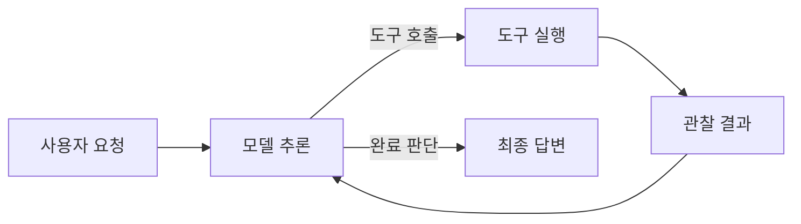
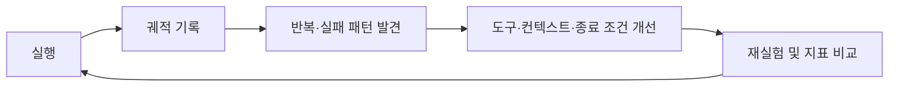
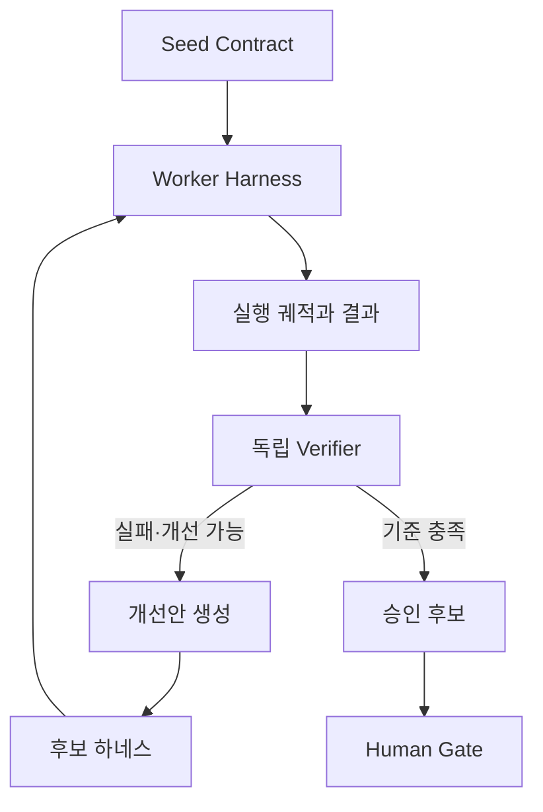
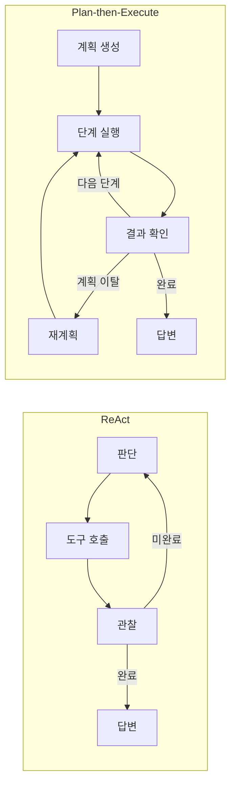
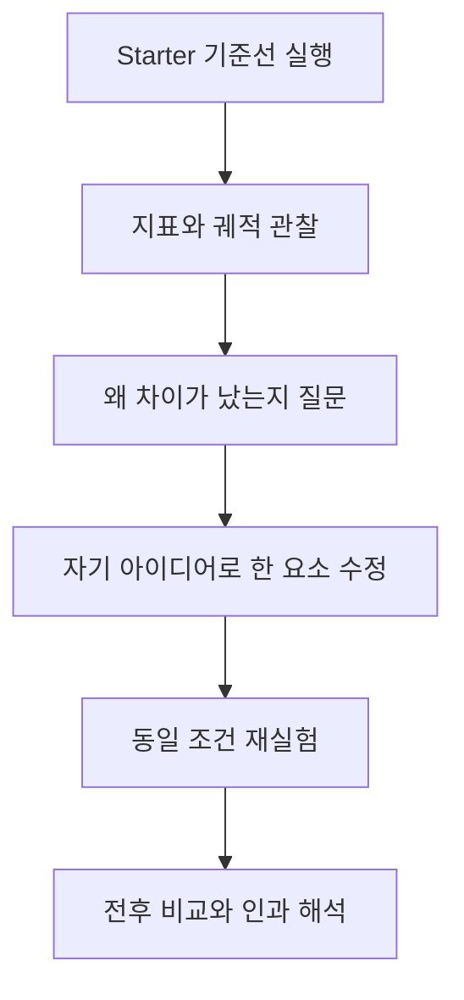

# Week 2 강의 정리

이 문서는 Week 2 수업 녹취록 `AX-2-1`, `AX-2-2`, `AX-2-3`을 바탕으로 작성했다.
각 교시의 **이론**은 강의에서 설명된 내용을 정리한 것이고, **교수님이 관심 있어 보이는 것**은 반복적으로 강조하거나 직접 해보기를 권한 주제를 중심으로 정리한 나의 해석이다.

---

## 2-1: Agent Harness와 ReAct

### 이론

#### 1. 에이전트와 하네스

에이전트는 단순히 LLM을 한 번 호출하는 프로그램이 아니다. 모델에 컨텍스트와 도구를 제공하고, 모델의 판단에 따라 도구를 실행한 뒤 그 결과를 다시 모델에게 돌려주는 반복 구조가 필요하다. 이 실행 환경 전체를 **에이전트 하네스(agent harness)**라고 볼 수 있다.

하네스의 기본 흐름은 다음과 같다.

#### 2. ReAct

ReAct는 **Thought → Action → Observation**을 반복하는 방식이다.

- Thought: 현재 상황에서 무엇을 해야 할지 판단한다.
- Action: 필요한 도구를 선택해 호출한다.
- Observation: 도구 실행 결과를 확인한다.
- 관찰 결과를 근거로 다음 행동을 결정하거나 답을 종료한다.

Chain-of-Thought만 길게 이어 가면 초반의 잘못된 추론이 뒤 단계까지 전파될 수 있다. ReAct는 외부 도구의 실제 결과를 Observation으로 받아 추론을 수정할 기회를 만든다.

#### 3. 하네스 설계의 다섯 요소

1. **컨텍스트 관리**: 대화와 실행 기록이 길어질 때 무엇을 유지하고 압축할지 결정한다.
2. **도구의 세분성**: 작은 범용 도구를 줄지, 여러 동작을 결합한 고수준 도구를 줄지 결정한다.
3. **종료 조건**: 모델의 완료 선언, `finish` 도구, `max_steps`, 테스트 통과 등 명시적인 종료 기준을 둔다.
4. **오류 복구**: 도구 오류를 숨기지 않고 Observation으로 반환해 모델이 수정할 수 있게 한다.
5. **Human Gate**: 비용이 크거나 되돌리기 어렵고 책임이 필요한 행동은 사람의 승인을 거치게 한다.

#### 4. 도구의 세분성

처음에는 `read_file`, `count_pattern`처럼 작고 범용적인 도구로 시작할 수 있다. 실행 궤적에서 동일한 도구 조합이 반복된다면, 그 패턴을 `count_by_hour` 같은 복합 도구로 승격할 수 있다. 이는 추상적인 추측보다 실제 사용 기록에서 필요한 도구를 귀납적으로 발견하는 방식이다.

#### 5. 종료와 검증

모델이 “완료했다”고 말하는 것만으로 실제 완료를 보장할 수 없다. 테스트, 파일 존재 여부, 예상 출력 비교처럼 가능한 부분은 결정론적으로 검사해야 한다. `max_steps`는 무한 반복을 막는 안전장치이지만, 정답의 신뢰성을 보증하는 검증기는 아니다.

#### 6. 관측 가능성

에이전트를 개선하려면 최종 답만 보는 것이 아니라 프롬프트, 도구 호출, Observation, 오류, 토큰 사용량, 반복 횟수로 이루어진 **trajectory(실행 궤적)**를 기록해야 한다. 측정 가능한 시스템이어야 병목과 실패 원인을 찾아 개선할 수 있다.

### 교수님이 관심 있어 보이는 것

#### 강의에서 직접 강조하거나 권한 것

- ReAct 논문과 *The Bitter Lesson*을 읽고 에이전트 설계와 연결해 보기
- Codex, Oh My Pi 같은 코딩 에이전트의 컨텍스트 압축 방식을 살펴보기
- 실제 코딩 에이전트의 실행 궤적을 분석하기
- Microsoft SkillOpt, Auto-Dreaming 등 실행 기록에서 스킬을 발굴하는 접근 살펴보기
- Meta-Harness처럼 에이전트 하네스 자체를 개선하는 연구 살펴보기
- 도구의 세분성을 바꾸었을 때 성공률·토큰·호출 수가 어떻게 변하는지 실험하기

#### 나의 해석

교수님은 단순히 더 강한 모델을 붙이는 것보다 **에이전트의 실행 과정을 관찰하고, 반복 패턴을 찾아 하네스 구조를 개선하는 연구**에 큰 관심이 있어 보인다. 특히 다음 흐름이 강의 전반에서 반복된다.

따라서 단순 구현보다 “어떤 실행 기록을 근거로 무엇을 바꾸었고, 그 결과 지표가 어떻게 달라졌는가”를 설명할 수 있는 작업을 흥미롭게 볼 가능성이 크다.

---

## 2-2: Meta-Harness와 자기 개선

### 이론

#### 1. Meta-Harness

일반 하네스가 작업을 수행하는 에이전트를 감싸는 구조라면, **Meta-Harness**는 그 하네스를 평가하고 개선하는 바깥쪽 반복 구조다. 개선 에이전트에는 단순 요약만 주기보다 현재 코드, 점수, 실패 사례, 실행 궤적처럼 원인 분석에 필요한 증거를 제공해야 한다.

#### 2. 독립 검증기

작업을 수행한 에이전트와 검증기가 같은 컨텍스트를 공유하면 작업자의 가정과 오류까지 함께 물려받을 수 있다. 가능하면 별도의 세션이나 독립된 컨텍스트에서 검증하고, 자연어 자기평가보다 테스트나 스키마 검사 같은 외부 증거를 사용해야 한다.

#### 3. Ouroboros 구조

강의에서 설명한 자기 개선 구조는 다음 요소로 이해할 수 있다.

- **Seed Contract**: 시스템의 목표, 허용 범위, 평가 기준을 정의한다.
- **Runner/Trace**: 현재 하네스를 실행하고 전체 궤적을 남긴다.
- **Deterministic Verifier**: 결과가 기준을 충족했는지 외부에서 검사한다.
- **Evolution Loop**: 실패와 비용을 분석해 새로운 후보를 만들고 다시 평가한다.

자기 개선 시스템이 평가 기준까지 임의로 바꾸게 하면 보상 해킹이 일어날 수 있다. 따라서 핵심 acceptance criteria와 verifier는 쉽게 변하지 않는 기준으로 두어야 한다.

#### 4. 자기 개선 연구의 흐름

강의에서는 Self-Refine, Reflexion, DSPy, GEPA, Meta-Harness, Darwin Gödel Machine 등 모델이나 에이전트가 피드백을 이용해 자신을 개선하는 연구 흐름을 함께 다뤘다. 공통점은 실행 결과를 평가하고 그 피드백을 다음 시도에 반영하는 것이다.

#### 5. 자동화의 경계

에이전트가 개선안을 제안하고 실험하는 부분은 자동화할 수 있지만, 운영 배포나 책임이 따르는 의사결정까지 자동 승인하는 것은 위험하다. 먼저 제한된 범위의 canary 실험으로 확인하고 최종 승인은 Human Gate에 남기는 방식이 필요하다.

### 교수님이 관심 있어 보이는 것

#### 강의에서 직접 강조하거나 권한 것

- 결과 요약보다 전체 코드, 점수, 실패 궤적을 개선 루프의 입력으로 사용하기
- 작업자와 분리된 독립 verifier를 설계하기
- acceptance criteria를 고정해 자기 개선 과정의 보상 해킹을 막기
- 자기 개선 에이전트가 어디까지 제안하고 사람이 어디서 승인할지 경계를 설계하기
- Meta-Harness와 Darwin Gödel Machine 같은 자기 개선 시스템 연구하기
- 수업 밖에서도 연구 살롱에 참여하고, 필요한 경우 GPU 지원을 받아 실험하기

#### 나의 해석

교수님은 “에이전트가 스스로 코드를 고친다”는 시연 자체보다, **검증 가능한 자기 개선 시스템을 어떻게 안전하게 설계할 것인가**에 관심이 있어 보인다. 특히 작업자와 평가자의 분리, 변경 불가능한 평가 기준, 전체 궤적을 근거로 한 개선, 사람의 최종 책임이라는 네 요소가 중요하다.

연구 아이디어로 발전시킨다면 Worker–Verifier를 서로 다른 컨텍스트로 분리하고, 동일한 테스트셋에서 성공률·토큰·도구 호출 수를 측정하면서 하네스 개선안을 반복 적용하는 형태가 강의 방향과 잘 맞는다.

---

## 2-3: ReAct와 Plan-then-Execute 비교 실습

### 이론

#### 1. 통제된 A/B 비교

이번 실습은 같은 모델, 같은 태스크, 같은 도구를 사용하고 **하네스만** ReAct와 Plan-then-Execute로 바꾸어 차이를 비교한다. 다른 조건을 고정해야 결과 차이를 하네스 구조의 영향으로 해석할 수 있다.

#### 2. ReAct와 Plan-then-Execute

ReAct는 매 단계에서 관찰 결과를 보고 다음 행동을 결정한다. 필요한 행동만 수행하고 빠르게 끝날 수 있지만, 모델이 너무 일찍 완료를 선언하면 충분한 검증 없이 종료될 수 있다.

Plan-then-Execute는 먼저 전체 계획을 만든 뒤 각 단계를 실행한다. 구조적이고 계획을 점검하기 쉽지만, 이미 정답을 얻은 뒤에도 남은 계획을 계속 수행하거나 같은 정보를 반복해서 확인하면 토큰과 도구 호출이 크게 증가한다. 계획이 어긋났을 때 재계획을 허용하면 유연성은 높아지지만 비용도 늘 수 있다.

#### 3. 측정해야 하는 지표

- 태스크 성공 여부
- 사용 토큰 수
- 모델 호출 또는 반복 횟수
- 사람의 개입 횟수
- 재계획 횟수와 도구 오류
- 실행 시간과 실패 궤적

한 번의 실행은 모델 출력의 확률성 때문에 우연일 수 있으므로 같은 조건에서 최소 세 번 실행하고 평균뿐 아니라 분산과 개별 궤적도 함께 살펴야 한다.

#### 4. 검소함(Frugality)

에이전트 평가는 정답 여부만으로 끝나지 않는다. 같은 성공을 더 적은 토큰과 도구 호출로 달성한다면 더 검소한 하네스다. 다만 호출 수를 줄이느라 검증을 제거하면 신뢰성이 낮아질 수 있으므로 성공률, 비용, 검증 강도를 함께 봐야 한다.

#### 5. 도구 개선 사례

로그를 시간대별로 집계하는 태스크에서 `count_pattern`을 시간마다 반복 호출하는 대신 `count_by_hour`처럼 태스크에 맞는 복합 도구를 만들 수 있다. 교수님은 실습 중 실제로 이 방향으로 도구를 바꾸었고 토큰과 실행 시간이 줄어드는 결과를 확인했다. 이는 2-1에서 설명한 “반복 궤적에서 새로운 도구를 귀납적으로 발견한다”는 원리가 실습에 적용된 사례다.

#### 6. Pi 기반 확장

기본 실습 코드는 Python으로 모델 호출, 메시지 상태, 도구 스키마, 실행 반복을 직접 구현한다. 욕심이 있는 학생은 같은 ReAct/Plan 정책을 유지하면서 이 실행 백본을 Pi의 에이전트 런타임에 올리는 확장을 시도할 수 있다. 이는 Pi에게 코드를 대신 작성시키라는 뜻이 아니라, 직접 만든 하네스의 실행 기반을 Pi로 교체하고 구조와 지표의 차이를 비교해 보라는 선택 과제에 가깝다.

#### 7. 실습과 과제의 차이

- 실습: 두 하네스를 구현하고 같은 태스크로 반복 실행해 결과와 로그를 얻는다.
- 과제: 왜 차이가 발생했는지 실행 궤적을 근거로 해석하고, 구조도와 개선 아이디어를 보고서로 제출한다.

코딩 에이전트를 사용해 구현할 수는 있지만, 생성된 코드를 읽고 실행 구조를 직접 설명할 수 있어야 한다. Mermaid 구조도 역시 장식이 아니라 자신이 만든 하네스의 흐름을 이해했는지 확인하는 도구다.

### 교수님이 관심 있어 보이는 것

#### 강의에서 직접 강조하거나 권한 것

- 제공된 starter를 그대로 실행하는 데서 끝내지 말고 자신의 취향과 아이디어를 반영해 수정하기
- 자신의 하네스 구조를 Mermaid로 그려 보기
- 반복되는 `count_pattern`을 `count_by_hour` 같은 복합 도구로 바꾸고 전후 지표를 비교하기
- Plan-then-Execute를 어떻게 더 검소하게 만들지 고민하기
- ReAct가 verifier 없이 빨리 낸 답을 신뢰할 수 있는지 질문하기
- 모델과 하네스에 따라 Plan 방식의 비용 차이가 왜 크게 달라지는지 궤적으로 설명하기
- 더 확장하고 싶은 경우 실습 백본을 Pi 기반으로 바꾸어 보기
- 구현 결과보다 자신의 사고 과정, 실패한 시도, 해석을 보고서에 솔직하게 남기기

#### 나의 해석

교수님이 보고 싶어 하는 것은 starter의 단순 실행 결과가 아니라 다음과 같은 작은 연구 사이클로 보인다.

따라서 가장 수업 취지에 맞는 확장은 기능을 많이 추가하는 것이 아니라, 예를 들어 도구 하나를 `count_by_hour`로 개선한 뒤 기준선과 다시 비교하여 **왜 토큰·호출 수·오류 양상이 변했는지 증거로 설명하는 것**이다. Pi 기반 재구현은 더 큰 확장안이고, 먼저 작은 변경을 정확히 측정하는 편이 연구 결과로서 해석하기 쉽다.

---

## 세 교시를 관통하는 핵심

Week 2의 전체 흐름은 다음 한 문장으로 요약할 수 있다.

> 에이전트의 성능은 모델만이 아니라 하네스에 의해 결정되며, 실행 궤적을 측정하고 독립적으로 검증하면서 도구·컨텍스트·종료 조건을 반복 개선해야 한다.

교수님의 관심은 특히 다음 연결에 집중되어 있다고 해석했다.

1. **관측 가능성**: 전체 trajectory를 남긴다.
2. **패턴 발견**: 반복 호출, 오류, 불필요한 계획 단계를 찾는다.
3. **하네스 개선**: 도구 세분성, 컨텍스트, 종료·검증 방식을 바꾼다.
4. **통제 실험**: 나머지 조건을 고정하고 여러 번 재실행한다.
5. **독립 검증**: 작업자의 자기평가와 분리된 기준으로 결과를 확인한다.
6. **안전한 자기 개선**: 개선안은 자동 생성할 수 있지만 평가 기준과 최종 승인은 보호한다.

이 관점에서 좋은 제출물이나 후속 연구는 “무엇을 만들었다”에 그치지 않고, **실행 기록에서 어떤 문제를 발견했고 어떤 변경이 어떤 지표를 왜 바꾸었는지**까지 보여 주는 작업이다.
